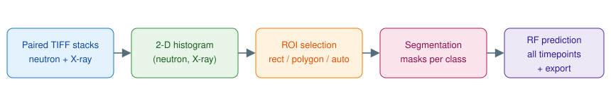

# BiTS 4D — Bivariate Tomography Segmentation

BiTS 4D is a desktop application for segmenting **paired neutron / X-ray
tomography datasets**, including time-resolved (4D) series. Because the two
modalities respond to different material properties, plotting every voxel as a
point in the 2-D *(neutron intensity, X-ray intensity)* plane separates
materials that are indistinguishable in either modality alone. Segmentation is
performed by selecting regions in that **bivariate histogram** and mapping them
back to voxels.



## Features

- **Dual 2-D histogram view** — global (all timepoints) and local (current
  timepoint) side by side, with log scale, display range controls, and
  GPU-accelerated accumulation (CUDA via PyTorch, automatic CPU fallback).
- **Histogram-space ROIs** — rectangle and polygon tools, draggable-vertex
  editing, save/load to JSON, and named multi-class ROIs for multi-material
  segmentation.
- **Selection panel** — manage every selection drawn on the histogram: show
  or hide each class (hidden classes are excluded from segmentation too, so
  you can work with one at a time), pull one back for reshaping with *Edit*,
  rename, remove, or isolate with *Only This*.
- **Spatial → histogram selection** — draw a rectangle or grow a region
  (2-D or full 3-D, univariate or bivariate) on the slice viewer and convert
  it into a histogram ROI automatically.
- **Automated segmentation** — multi-level Otsu thresholding and K-means
  clustering (2-D slice, 3-D volume, or hybrid) that generate class masks
  and histogram overlays.
- **Materials panel** — every material, whether drawn on the histogram or
  copied from a K-means clustering, listed with a per-material toggle:
  *Changes* or *Stays unchanged*. Marking the second kind gives every other
  result an independent check. Smoothing, preview, run and the health-check
  readout are all on the same panel.
- **Built-in manual** — *Help → Manual* (F1): how to do each operation, and
  the mathematics behind each one, searchable and exportable as text.
- **Analysis and export** — per-selection statistics, morphological analysis,
  time-series tracking, histogram-evolution maps, and export to
  TIFF / CSV / Excel / PDF. Exports are named after your classes
  ("Lithium", not "Class 1"), and can optionally include the **bimodal
  histogram of each class** at every timepoint, computed on the main
  histogram's bin grid so the files compare directly, plus a
  **`segmentation_report.txt`** recording each class's name, its integer
  value in the exported label volumes, its voxel count at every timepoint,
  and the settings the segmentation was made with.
- **Quality metrics** — *Analytics → Histogram Time Analysis → Histogram &
  Segmentation Metrics* writes a CSV of every ground-truth-free metric
  (streak and smear scores, marginal asymmetry and drift, Davies–Bouldin
  separability, per-class spread, elongation and centroid drift) for the
  global histogram and for each timepoint, plus a multi-panel plot of how
  each one evolves. *Spatial Metrics* adds the same for the volume —
  centre of mass and its drift, radius of gyration, connected components,
  surface-to-volume, class interface areas. See
  [docs/metrics.md](docs/metrics.md).
- **Time-series segmentation** — *Analytics → Time Series Segmentation*
  measures every timepoint against the materials you drew once, with the
  definitions held fixed so a change in a volume is a change in the sample.
  Spatial smoothing strength is chosen automatically rather than left at a
  default, boundary costs are learned from your own reference labels,
  materials you mark as unchanging act as a null control, and a health check
  runs before any numbers are shown — a run that has gone wrong invisibly
  does not reach a results screen. Start with
  [docs/workflow.md](docs/workflow.md).
- **Big-dataset mode** — all histograms are computed once at load and served
  from memory; volumes larger than 1 GiB are median-binned for display (with
  segmentation still running at full resolution), so time scrolling and
  slice browsing stay smooth on multi-gigabyte series.
- **Histogram time analysis** — *Analytics → Histogram Time Analysis* saves
  four complementary images: joint-histogram **evolution** (each timepoint
  vs T0, cumulative drift) and **incremental change** (vs the previous
  timepoint, showing *when* events happen), plus the same pair for the
  **marginals** (each modality's 1-D histogram against time, separating a
  neutron shift from an X-ray shift).

## Installation

```bash
git clone https://github.com/OriolSansPlanell/BITS-4D.git
cd BITS-4D
python -m venv .venv && source .venv/bin/activate   # optional
pip install -r requirements.txt
```

Python 3.10+ is recommended. Optional extras (enabled automatically when
installed):

| Package | Enables |
| --- | --- |
| `scikit-image` | Multi-level Otsu thresholding |
| `pandas` + `openpyxl` | Excel statistics export |
| `torch` (CUDA build) | GPU histogram accumulation |

## Quick start

```bash
python main.py
```

> **New here?** [`docs/workflow.md`](docs/workflow.md) walks through the nine
> steps of a segmentation run. The short version follows.

1. **Load data** — *File → Load 4D Dataset*, choosing the neutron and X-ray
   TIFF stacks. Both must have identical shapes: `(T, Z, Y, X)` for 4D or
   `(Z, Y, X)` for 3D (*Settings → Data Mode* switches modes). The global
   histogram is computed on load.
2. **Select** — draw a rectangle or polygon on the global histogram
   (x-axis = neutron intensity, y-axis = X-ray intensity). Optionally save it
   as a named class (e.g. "Lithium") and draw further classes, or create the
   ROI from a spatial selection in the slice viewer.
3. **Segment** — *✂ Segment Current* applies every ROI shown on the histogram
   (all named classes **and** the active one) to the current timepoint;
   *✂✂ Segment All* processes the whole series. Each class becomes a coloured
   overlay in the slice viewer.
4. **Track the series** — on the *🧱 Materials* tab, mark anything that
   cannot change as *Stays unchanged*, then **Preview** one timepoint and
   **Run all timepoints**. Smoothing is chosen for you and the result is
   checked before it is shown.
5. **Export** — masked volumes, binary masks, and label maps as TIFF;
   per-class bimodal histograms and a `segmentation_report.txt`; statistics
   as CSV/Excel; reports as PDF.
6. **Measure (optional)** — *Analytics → Histogram Time Analysis →
   Histogram & Segmentation Metrics* for the metrics CSV and evolution plot.

## Library usage (no GUI)

The computational engines are plain Python classes and can be scripted:

```python
import numpy as np
from histograms import HistogramEngine4D
from segmentation import SegmentationEngine4D
from utils.roi_manager import ROIManager

neutron = np.load("neutron_4d.npy")   # (T, Z, Y, X)
xray = np.load("xray_4d.npy")

engine = HistogramEngine4D(bins=256, use_gpu=False)
hist = engine.compute_global_histogram(neutron, xray)

roi = ROIManager()
roi.set_rectangle_roi(x_min=100, y_min=800, x_max=300, y_max=1000)
#                     ^ neutron range        ^ X-ray range

mask_4d = SegmentationEngine4D().segment_all_volumes(neutron, xray, roi)
stats = SegmentationEngine4D.get_temporal_statistics(mask_4d, neutron, xray)
```

See [`docs/workflow.md`](docs/workflow.md) for the step-by-step segmentation
workflow, [`docs/architecture.md`](docs/architecture.md) for the module map,
the histogram coordinate conventions, and extension guidelines,
[`docs/model_segmentation.md`](docs/model_segmentation.md) for the method
behind the time-series segmentation,
[`docs/metrics.md`](docs/metrics.md) for the quality metrics and their CSV
layout, [`docs/v17_plan_evaluation.md`](docs/v17_plan_evaluation.md) for how
the v17 proposal was assessed and where it was corrected, and
[`docs/changes.md`](docs/changes.md) for the bug-fix history of this
refactoring pass.

## Testing

```bash
pip install -r requirements-dev.txt
python -m pytest
```

The suite covers histogram correctness against NumPy references, ROI
containment and selection/segmentation parity, K-means and Random Forest
pipelines, cancellation, and data loading.

## Repository layout

```
main.py                  Application entry point
data/                    TIFF loading and 4D dataset container
histograms/              Chunked CPU/GPU 2-D histogram engine
segmentation/            ROI segmentation, K-means→material conversion, legacy/
model/                   Anchored mixture, MRF, drift tracking, sequential segmenter
utils/                   ROI manager, clustering, region growing, metrics, exports
gui/                     PyQt5 widgets (main window, histograms, viewers)
tests/                   pytest suite
docs/                    Architecture, method and change documentation
```

## License

See [LICENSE](LICENSE).
